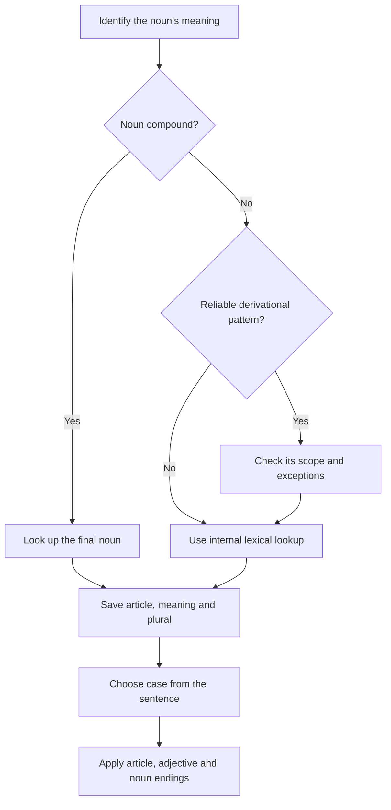

# Internal lookup and decision guide

If only a tendency is available, mark the guess and verify it in the internal lexicon before treating it as a learned fact. Required course nouns must already have complete entries. Add a corrected personal review card after a mistake; no external dictionary or Anki installation is required.
