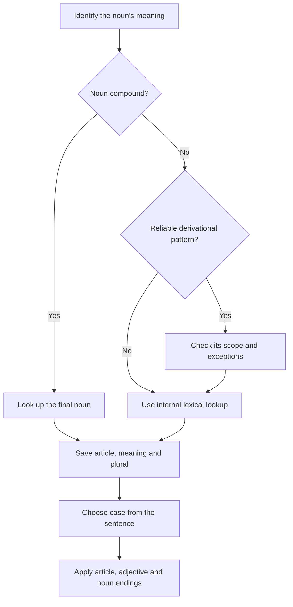

# Articles, cases and endings: corrected seed reference

**Version:** 1.0 — 23 September 2026. Adapted from the supplied `reference_articles_cases.md`. This provides actual starting content for the internal reference system, not the entire C1 grammar atlas required by [COURSE_SPEC.md](COURSE_SPEC.md). Expand it with graded exercises, explained solutions, audio and lexical entries during implementation.

Use **rule** for a reliable pattern within an explicit scope, **tendency** for a useful but fallible prediction, and **lexical fact** for a form to learn and verify individually. An ending that merely looks like a suffix is not evidence of that suffix. Give every rule stable content IDs, examples, exceptions and source/review metadata when importing it into the app.

## 1. Gender and case are different decisions

**Genus** is lexical gender; **Kasus** is the grammatical form required in the sentence. Learn gender with a noun's meaning: **die Firma → mit der Firma**. The noun is still feminine. **die Lieferung** is feminine singular; **die Verträge** is plural. An article form alone may identify several possible cases/genders.

Grammatical gender is not the same as a person's gender: **das Mitglied**, **die Person**, **der Gast**. Store noun senses separately: **der Leiter** means a manager, **die Leiter** a ladder; **das Gehalt** is salary, **der Gehalt** is content. Regional or accepted gender variants also require lexical records, not a rule that every spelling has exactly one gender.

Learn a package: **die Lieferung · die Lieferungen · delivery · eine Lieferung erhalten · Die Lieferung trifft morgen ein.** Include pronunciation/stress and collocations. If there is no usual plural in the intended sense, say so instead of inventing one.

## 2. Article forms

**Definite article**: generally identifies something known or identifiable in context.

| Case | Masculine singular | Feminine singular | Neuter singular | Plural |
|---|---|---|---|---|
| Nominative: subject | der | die | das | die |
| Accusative: e.g. direct object | den | die | das | die |
| Dative: e.g. after mit | dem | der | dem | den |
| Genitive: e.g. possession/relationship | des | der | des | der |

**Ein-word forms**: singular forms below use *ein*. *Kein* and possessives such as *mein* follow the same ending pattern. *Ein* has no plural; the plural column illustrates *kein*.

| Case | Masculine singular | Feminine singular | Neuter singular | Plural with kein |
|---|---|---|---|---|
| Nominative | ein | eine | ein | keine |
| Accusative | einen | eine | ein | keine |
| Dative | einem | einer | einem | keinen |
| Genitive | eines | einer | eines | keiner |

Examples: **mein Vertrag**, **meine Verträge**, **mit meinen Verträgen**. With *euer*, common forms are **eure**, **eurem**, **euren**. Capitalize the polite possessive **Ihr** where it refers to the addressee.

The zero article occurs in contexts such as indefinite plural **Wir prüfen Angebote**, a material/general concept **Wir brauchen Zeit**, and a profession **Sie ist Ingenieurin**. An adjective can change the noun phrase: **Sie ist eine erfahrene Ingenieurin**. Teach the relevant context, not “plural nouns never have articles.”

| Full phrase | Contraction | Case |
|---|---|---|
| an dem / in dem | am / im | Dative |
| bei dem / von dem | beim / vom | Dative |
| zu dem / zu der | zum / zur | Dative |
| an das / in das | ans / ins | Accusative |
| für das / über das | fürs / übers | Accusative |

Noun endings are a separate step from selecting the article. Dative plural and genitive exceptions appear below; **des** does not mean “always append -s.”

## 3. Pronouns

| Case | ich | du | er | sie singular | es | wir | ihr | sie plural / Sie polite |
|---|---|---|---|---|---|---|---|---|
| Nominative | ich | du | er | sie | es | wir | ihr | sie / Sie |
| Accusative | mich | dich | ihn | sie | es | uns | euch | sie / Sie |
| Dative | mir | dir | ihm | ihr | ihm | uns | euch | ihnen / Ihnen |

Reflexive forms: **mich/mir**, **dich/dir**, **sich** for third person and polite *Sie*, **uns**, **euch**. Compare **Ich wasche mich** and **Ich wasche mir die Hände**. Learn the verb's required construction rather than guessing from an English translation.

Relative pronouns agree with the antecedent in gender/number, while their case comes from their role inside the relative clause: **die Kollegin, mit der ich arbeite**.

| Case | Masculine | Feminine | Neuter | Plural |
|---|---|---|---|---|
| Nominative | der | die | das | die |
| Accusative | den | die | das | die |
| Dative | dem | der | dem | denen |
| Genitive | dessen | deren | dessen | deren |

## 4. Adjective endings

First establish gender/number and case, then identify the determiner pattern. These tables cover the core patterns; quantifiers with variation need separate entries in the full atlas.

**Weak**, after a fully declined der-word:

| Case | Masculine | Feminine | Neuter | Plural |
|---|---|---|---|---|
| Nominative | der neue Vertrag | die neue Lieferung | das neue Konto | die neuen Verträge |
| Accusative | den neuen Vertrag | die neue Lieferung | das neue Konto | die neuen Verträge |
| Dative | dem neuen Vertrag | der neuen Lieferung | dem neuen Konto | den neuen Verträgen |
| Genitive | des neuen Vertrags | der neuen Lieferung | des neuen Kontos | der neuen Verträge |

Memory aid: **-e** in singular nominative and feminine/neuter accusative; **-en** elsewhere in this pattern.

**Mixed**, after an ein-word:

| Case | Masculine | Feminine | Neuter | Plural with kein |
|---|---|---|---|---|
| Nominative | ein neuer Vertrag | eine neue Lieferung | ein neues Konto | keine neuen Verträge |
| Accusative | einen neuen Vertrag | eine neue Lieferung | ein neues Konto | keine neuen Verträge |
| Dative | einem neuen Vertrag | einer neuen Lieferung | einem neuen Konto | keinen neuen Verträgen |
| Genitive | eines neuen Vertrags | einer neuen Lieferung | eines neuen Kontos | keiner neuen Verträge |

Where *ein* has no ending, the adjective supplies the missing **-er** or **-es** signal. This memory aid applies to the displayed pattern, not every determiner construction.

**Strong**, illustrated without an article:

| Case | Masculine | Feminine | Neuter | Plural |
|---|---|---|---|---|
| Nominative | guter Service | gute Qualität | gutes Material | gute Ergebnisse |
| Accusative | guten Service | gute Qualität | gutes Material | gute Ergebnisse |
| Dative | gutem Service | guter Qualität | gutem Material | guten Ergebnissen |
| Genitive | guten Services | guter Qualität | guten Materials | guter Ergebnisse |

The important genitive masculine/neuter forms here are **-en**, not *-es*. For example: **wegen schlechten Wetters**. Do not turn “the adjective carries the article signal” into a rule without this qualification.

## 5. Noun endings and plurals

| Pattern | Correct examples | Scope |
|---|---|---|
| Dative plural adds -n where the plural permits it | Verträge → mit den Verträgen; Kinder → mit den Kindern | No extra -n after an existing -n or -s: mit den Kunden, mit den Teams. Some foreign plurals remain unchanged; store the actual forms |
| Many masculine/neuter genitives use -(e)s | der Vertrag → des Vertrags; das Kind → des Kindes | This is not the rule for all masculine/neuter nouns |
| Weak masculine nouns | der Kunde → den/dem/des Kunden; der Kollege → des Kollegen | Learn lexical membership; singular non-nominative forms use -(e)n |
| Special weak form | der Herr → den/dem/des Herrn; plural die Herren | Singular and plural endings differ |
| Mixed forms | der Name → den/dem Namen, des Namens | Keep separate from ordinary weak nouns |
| Neuter mixed form | das Herz → dem Herzen, des Herzens | A special lexical pattern; do not call it a masculine noun |

Useful plural patterns, always learned with the entry:

| Pattern | Examples | Reliability |
|---|---|---|
| Feminine -ung/-heit/-keit/-schaft/-tion/-ität nouns usually add -en | Lieferungen, Möglichkeiten, Qualitäten | Reliable within the relevant productive pattern |
| Diminutives -chen/-lein remain unchanged in plural | das Mädchen → die Mädchen | Rule for these suffixes |
| Many feminine nouns use -(e)n | Frage → Fragen | Tendency; Stadt → Städte and Mutter → Mütter differ |
| Many masculine nouns use -e, sometimes with umlaut | Termin → Termine; Vertrag → Verträge | Tendency |
| Some neuter nouns use -er with possible umlaut | Kind → Kinder; Buch → Bücher | Lexical pattern, not all neuter nouns |
| Foreign stem replacement | Zentrum → Zentren; Datum → Daten; Thema → Themen | Learn the whole form; do not append -en to the unchanged singular |
| Common -s plurals | Büro → Büros; Team → Teams | Tendency for relevant loanwords |

In usual workplace senses, **das Personal**, **das Wissen** and **die Logistik** do not need an ordinary plural; **die Kosten** is used as a plural. Check the sense and context before marking a noun universally “no plural.”

## 6. Gender patterns and memory aids

| Pattern and scope | Gender | Examples | Qualification |
|---|---|---|---|
| True derivational -ung, -heit, -keit, -schaft | Feminine | die Lieferung, die Freiheit, die Möglichkeit, die Belegschaft | **der Sprung** only looks like an -ung derivation |
| Relevant -tion/-sion and -ität formations | Feminine | die Information, die Diskussion, die Qualität | **der Spion**, **das Stadion** are not instances of the taught suffix |
| -in for female person nouns | Feminine | die Kundin, die Kollegin | Final letters in **der Termin** do not instantiate this suffix |
| True -ismus and -ling formations | Masculine | der Tourismus, der Lehrling | Identify the word-building pattern before using it |
| -ist for person nouns | Masculine | der Spezialist | **die Frist** is a look-alike, not this suffix |
| Diminutive -chen/-lein | Neuter | das Mädchen, das Büchlein | Grammatical gender follows the suffix |
| Infinitives used as nouns | Neuter | das Lernen, das Arbeiten | Not every noun ending in -en is a nominalized infinitive |
| Abstract nominalized adjective use | Neuter | das Neue, das Gute | Person references such as der Neue/die Neue follow a different use |

Keep less dependable endings in a **tendency** section: feminine **-e** (but **der Kunde**, **das Ende**), neuter **-nis** (but **die Erlaubnis**), neuter **-tum** (but **der Irrtum**), and common borrowed **-ment/-um/-ma** groups (compare **der Moment**, **der Konsum**, **die Firma**). Patterns such as **-ik**, **-ur** and **-or** need lexical/suffix scope; do not label final-letter guesses as exceptionless rules. Meaning groups can be memory aids, but examples such as *das Hotel* do not establish a rule for every hotel name.

For ordinary noun compounds, the final noun/head determines gender and the relevant plural: **die Lieferadresse** from **die Adresse**, **das Lieferdatum → die Lieferdaten** from **das Datum → die Daten**. Linking elements do not change the head: **die Arbeitszeit**.

Use consistent gender labels and optional colors, plus learner-chosen mini-stories. Make retrieval productive: identify the gender, retrieve the plural, then use the package in a new sentence with an assigned case. Mnemonics support memory; they do not make every article predictable.

## 7. Prepositions and case

| Construction | Examples | Teaching note |
|---|---|---|
| Common accusative prepositions | durch, für, gegen, ohne, um | **für den Kunden** includes both accusative article and weak noun ending |
| Common dative prepositions | aus, außer, bei, mit, nach, seit, von, zu | **mit der Kollegin**, **seit einem Monat** |
| Two-way prepositions | an, auf, hinter, in, neben, über, unter, vor, zwischen | Distinguish spatial destination from location; do not use movement alone |
| Genitive in formal standard contexts | wegen, trotz, während, innerhalb, außerhalb, aufgrund | **wegen des Termins**; teach context and register variants separately |

**Wir gehen ins Büro** describes entering a destination, accusative. **Wir gehen im Büro auf und ab** describes movement within a location, dative. Fixed combinations require their own government: **warten auf + accusative**, **teilnehmen an + dative**, **abhängig von + dative**.

Time expressions are **not always dative**. Learn the specific construction: **im Mai**, **am Montag**, **vor einer Woche**, but **über das Wochenende**, **für einen Monat**, **jeden Montag**. With combined prepositions, inspect the governing construction: **bis zum Termin** contains *zu + dative*. Do not apply the spatial question shortcut mechanically to temporal and abstract uses.

For things or propositions: **Worauf wartest du? — Ich warte darauf.** For people: **Auf wen wartest du? — Ich warte auf die Kollegin.** Insert **r** before a vowel in these compounds: **darauf**, **worüber**. A nominal compound and a da-/wo-compound are different constructions; define both terms.

## 8. Internal lookup and decision guide

If only a tendency is available, mark the guess and verify it in the internal lexicon before treating it as a learned fact. Required course nouns must already have complete entries. Add a corrected personal review card after a mistake; no external dictionary or Anki installation is required.

## 9. Correction and content regression examples

| Check | Required result |
|---|---|
| mit den Teams | Accept; do not add an extra -n |
| mit den Verträge | Correct to **mit den Verträgen**; noun-inflection issue |
| mit dem Kunde | Correct to **mit dem Kunden**; weak noun ending |
| des Kunden / des Namens / des Herzens | Accept; do not apply one universal -(e)s rule |
| über das Wochenende | Accept accusative; reject the blanket temporal-dative rule |
| ein neue Vertrag | Correct to **ein neuer Vertrag**; adjective ending once the determiner/gender context is established |
| guten Materials in a genitive phrase | Accept the strong genitive -en form |
| der Sprung / die Lieferung | Explain look-alike ending versus productive suffix |
| die Zentren / die Daten / die Themen | Accept full plural forms; reject mechanical *Zentrumen/Datumen/Themaen* |
| der Leiter / die Leiter | Keep distinct lexical senses |

Distinguish `GEN`, `CASE`, `NOUN` and `ADJ`, but do not pretend the cause is always visible. **mit der Vertrag** could reflect mistaken feminine gender with dative agreement, or correct masculine gender with an incorrect nominative form. Ask for the noun's dictionary article and the case after *mit*, or record the root cause as unresolved. The correction is **mit dem Vertrag**. Store all affected spans while linking predictable agreement consequences to one causal pattern.

## Verification references

The tables adapt user-provided material; the review specifically checked the noun-ending and temporal-case corrections against these grammar references on 23 September 2026:

- [Leibniz-Institut für Deutsche Sprache, grammis: noun declension](https://grammis.ids-mannheim.de/progr@mm/4064) — declension classes, dative plural and mixed noun forms.
- [LEO grammar: prepositions with two cases](https://dict.leo.org/grammatik/deutsch/Wort/Praeposition/Kasus/2Kasus.xml?lang=de) — spatial, temporal and other uses, including accusative temporal *über*.

Reference checks and automated regression examples supplement linguistic review; they do not constitute a human review of the entire future course.
